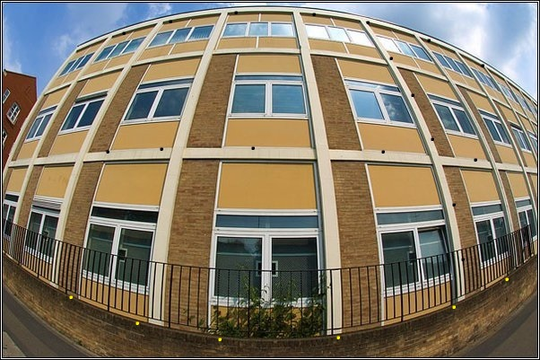
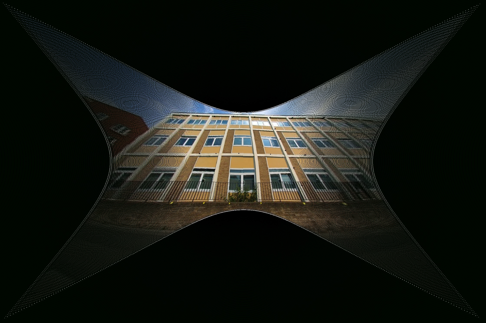
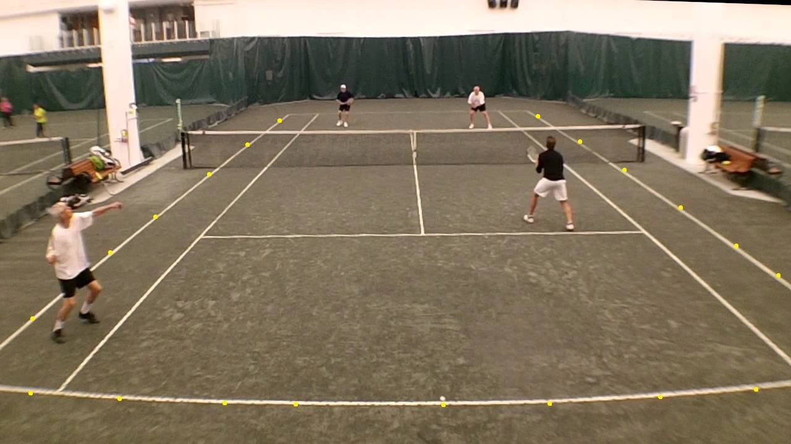
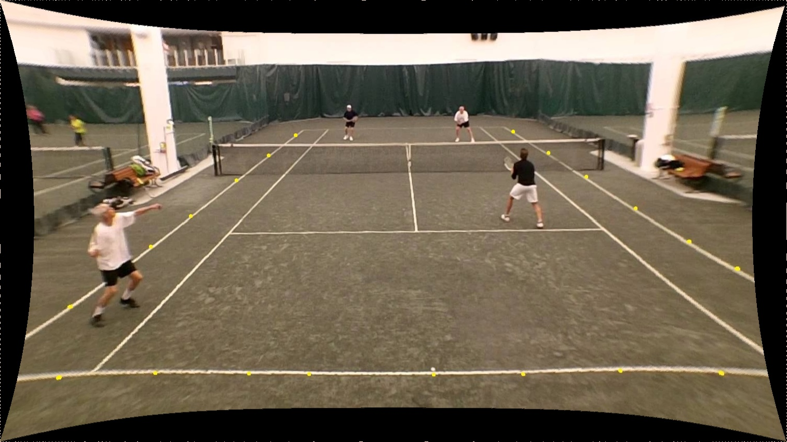

# undistort ``X``

Corrects fisheye distortion based on hypothesis: straight lines are straight

</br>

### Input
* Distorted image 
* Set of points from straight lines in the image (denoted below in black or yellow)



    %YAML:1.0
    pointsOnCurves:
        - [ [409, 24], [435, 64], [459, 105], [481, 154], [505, 227], [515, 288] ]
        - [ [119, 168], [179, 165], [281, 164], [426, 168], [529, 177] ]
        - [ [137, 36], [189, 23], [262, 13], [349, 15], [537, 72] ]
        - [ [78, 330], [152, 359], [244, 377], [376, 375], [507, 341], [564, 310] ]

### Output
* Undistorted image 
* Distortion coefficients



    %YAML:1.0
    distortionCoefficients: !!opencv-matrix
        rows: 7
        cols: 1
        dt: d
        data: [ 3.73507e-08, 4.9776e-11, -3.94392e-07, -3.60307e-05, 8.35396e-16, 300.154, 200.356 ]

---


### Input 
* Distorted image
* Distortion coefficients



    %YAML:1.0
    distortionCoefficients: !!opencv-matrix
        rows: 7
        cols: 1
        dt: d
        data: [ 2.19668e-16, 1.53243e-18, 5.91584e-14, -1.14718e-13, 1.17589e-18, 640, 360 ]

### Output
* Undistorted image



</br>

# How to build

Fastest way is to setup a docker image

```
docker build --file container/Dockerfile --tag personal-dev:latest .
```

and run ```spawn.sh``` for container prompt access, which auto-mounts source directory.

You can then build with:
```
cd SOURCE_DIR
mkdir build
cd build
cmake ..
make
```
</br>

# How to run

```
cd SOURCE_DIR
build/undistortX IMAGE_FILENAME YAML_FILENAME
```

where YAML format for point entries provided at intro section

</br>

# API

    undistort(const cv::Mat &input, const DistortionCoefficients& kd) -> bool

Undistorts input image with provided coefficients. Returns true on success, false on failure

    undistort(const cv::Mat &input, const std::vector<std::vector<cv::Point2d>> &pointsDistorted) -> bool

Undistorts input image with provided set of points. Returns true on success, false on failure

    getDistortionCoefficients() -> DistortionCoefficients

Get estimated distortion coefficients, after a call to ```Undistortion::undistort``` Returns coefficient set of 7 params: [ k1, k2, p1, p2, k3, cx, cy ]

    getUndistortedImage() -> cv::Mat

Get undistorted image, after a call to ```Undistortion::undistort```

</br>

Refer to ```sources/main.cpp``` for example API usage.